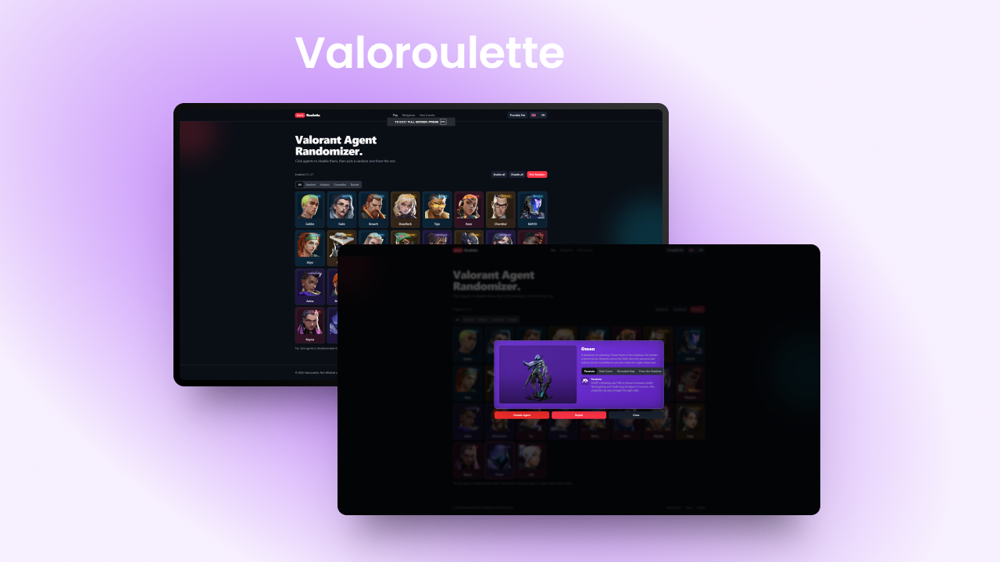

# Valoroulette

A sleek, open-source Valorant agent randomizer with a Night‑Market‑style reveal, multi-language support, and a modern React + Vite + Tailwind stack.

- Live preview: https://brownyprod.xyz/ui.valoroulette.com
- Screenshot / banner:
  

<p align="left">
  <a href="https://vitejs.dev" target="_blank"></a>
  <a href="https://react.dev" target="_blank"></a>
  <a href="https://www.typescriptlang.org/" target="_blank"></a>
  <a href="https://tailwindcss.com/" target="_blank"></a>
  <a href="https://radix-ui.com/" target="_blank"></a>
  <a href="https://vitest.dev/" target="_blank"></a>
</p>

---

## Features

- Agent randomizer with enable/disable filtering
- Night‑Market style reveal animation using full portraits
- Provably‑fair approach (selection computed before animation; uniform distribution over enabled agents)
- Multi‑language i18n (EN/ES/FR)
- Responsive, mobile‑first UI
- Built with React 18, Vite, Tailwind CSS, Radix UI, Framer Motion
- Zero backend required for core randomization

## Tech stack

- Build tooling: Vite 7, TypeScript 5, PNPM
- UI: React 18, Tailwind CSS 3, Radix UI, Framer Motion
- State/UX: shadcn‑style primitives, toast, accessible components
- 3D/visuals ready: three.js + @react-three/fiber (optional)
- Testing: Vitest

Key dependencies (see package.json for full list):
- react, react-dom, @vitejs/plugin-react-swc
- tailwindcss, @tailwindcss/typography, tailwind-merge
- framer-motion, lucide-react, radix‑ui components
- vitest

## Getting started

Prerequisites:
- Node.js 18+
- PNPM 10+

Install dependencies:

```bash
pnpm install
```

Run the development server (Vite):

```bash
pnpm dev
```

The app will be available on http://localhost:5173 by default.

Type‑check and tests:

```bash
pnpm typecheck
pnpm test
```

Build and preview locally:

```bash
pnpm build
pnpm preview -p 8080
```

Available scripts (from package.json):
- dev — start Vite dev server
- build — production build
- preview — local static preview
- start — alias preview on port 8080
- test — run unit tests via Vitest
- typecheck — run TypeScript
- format.fix — Prettier write

## Project structure

```
valoroulette/
├─ client/
│  ├─ pages/            # Routes (Index, HowItWorks, Minigames, 404)
│  ├─ i18n/             # Dictionary + provider (EN/ES/FR)
│  ├─ hooks/            # UI hooks (e.g., mobile, toast)
│  └─ lib/              # Utilities + tests
├─ public/              # Static assets (icons, preview images)
├─ index.html           # Vite entry (mounts client/App.tsx)
├─ tailwind.config.ts   # Tailwind setup
├─ vite.config.ts       # Vite config
└─ package.json
```

Notable UI entry points:
- client/pages/Index.tsx — homepage hero + AgentPicker
- client/components/agents/AgentPicker.tsx — core selection UI
- client/components/agents/AgentReveal.tsx — reveal overlay animation

## Internationalization (i18n)

- Languages: English (en), Spanish (es), French (fr)
- Strings live in client/i18n/dictionary.ts
- Runtime selection via a lightweight provider; see useI18n()

## Provably‑fair selection

- Selection is uniform over the set of enabled agents
- The chosen agent is computed first
- The reveal animation is purely presentational and does not influence randomness

## Deployment

This project is designed for static hosting and can be deployed anywhere that serves static files:

1. Build the project:
   ```bash
   pnpm build
   ```

2. Serve the `dist/` directory using your preferred method:
   - Apache/Nginx: Point document root to `dist/`
   - Node.js: Use Express or similar to serve static files
   - Any static file hosting service

Live preview: https://brownyprod.xyz/ui.valoroulette.com

## Contributing

Issues and PRs are welcome. If you plan a larger change, please open an issue to discuss first. Suggested steps:

1) Fork and create a feature branch
2) Keep changes focused and atomic
3) Add tests where it makes sense (Vitest)
4) Ensure `pnpm typecheck` and `pnpm test` pass
5) Submit a PR with a clear description and screenshots

## Acknowledgements and legal

- Valorant, the Valorant logo, and related assets are trademarks of Riot Games, Inc. This project is fan‑made and not affiliated with or endorsed by Riot Games.
- All product names, logos, and brands are property of their respective owners.

If you represent Riot Games or another rights holder and have concerns, please open an issue.

## License

This project is licensed under the **GNU Affero General Public License v3.0 (AGPL-3.0)**.

This means:
- You can use, modify, and contribute to this code
- Any derivative works must also be open source under AGPL-3.0
- If you run a modified version as a web service, you must make the source code available

See the [AGPL-3.0 license](https://www.gnu.org/licenses/agpl-3.0.en.html) for full details.
